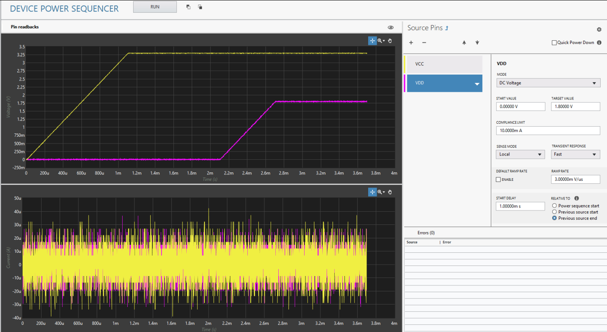

# Device Power Sequencer

This plug-in allows the user to control multiple power rails in a predefined sequence and with a controlled ramp rate.

## Supported Hardware

NI SMUs:
- PXIe-4135
- PXIe-4136
- PXIe-4137
- PXIe-4138
- PXIe-4139
- PXIe-4140
- PXIe-4141
- PXIe-4142
- PXIe-4143
- PXIe-4144
- PXIe-4145
- PXIe-4147

## Software Installation

(*This section is if you only want to use the pre-compiled plug-ins. If you want to open the source code, go to [software development](docs/sw-dev.md).*)  
Install from NI Package Manager:

- NI DCPower (2024 Q4 or greater)
- InstrumentStudio (2024 Q4 or greater)

Download the latest NI package from the releases section of this repo or add the feed to NI Package Manager to get updates from this repo and other in this community. To use the NI Package Manager feeds, refer to this: [Subscribing to package feeds](https://github.com/NI-MeasurementLink-Plug-Ins/package-manager-feeds)

## Getting Started

Check out the [manual](docs/manual.md) on how to use the plug-in.

## Contributing

Use the instructions in [software development](docs/sw-dev.md) for setting up a development environment and overview of the code.

