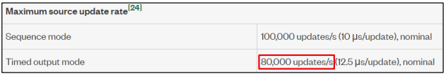

# Frequently Asked Questions

**Q: What happens when there is an error during Power Up?**  
**A:** When there is an error/compliance during Power Up, all the pins will be set to 0V/ 0A based on the source mode with Default ramp rate without any delays and this safety feature is called Safe Power Down. When there is an error during Safe Power Down, Emergency Power Down will be initiated which resets all pins.  

**Q: What is Emergency Power Down?**  
**A:** When there is an error during Power Down or Safe Power Down, all the pins will be reset, and this safety measure is called Emergency Power Down.  

**Q: Where can I find the log file that is generated?**  
**A:** Find the log files in the folder here: “C:\Users\Public\Documents\National Instruments\DPS\Logs”.  

**Q: Where do I see the error message description in case of any error?**  
**A:** Hover over the exclamatory icon for more error message description.  

**Q: What is the maximum voltage/current supported?**  
**A:**  It depends on the SMU specification used. Please refer to the SMU specification sheet.  

**Q: How many pins can be sequenced?**  
**A:** There are no limitations on the number of pins. So, any number of pins can be added, but execution time might be increased with the addition of pins. Beyond 31 pins, plot color will be white.  

**Q: How to calculate ramp rate supported by the device?**
**A:**  
1. Define Target Level and Ramp Rate.  
2. Check the number of updates/second in the specification sheet under Maximum Source Update rate and Timed output mode.
     
3. Calculate the number of updates/sec for the required Target Level and Ramp Rate.  
  - Number of Updates/sec = (Ramp Rate)/(Target Level)  
  - If the number of updates goes beyond the supported value, then the ramp rate should be decreased.  

Example 1:  
  - Target Level = 2V  
  - Ramp Rate = 200mV/us  
  - Number of updates/sec = (200mV/us)/2V  
  - Number of updates/sec = 100,000 which is **not** supported  

Example 2:  
  - Target Level = 2V  
  - Ramp Rate = 140mV/us  
  - Number of updates/sec = (140mV/us)/2V  
  - Number of updates/sec = 70,000 which is supported  

**Q: What is the recommended maximum Ramp Rate in no Load condition?**
**A:** Although the maximum ramp rate is based on SMU specifications explained in the previous question, it also depends on the certain other configurations and load conditions. In no load conditions, the ranges below are recommended for the steady expected ramp rate.  
| Transient Response     | Maximum Ramp Rate    |
| ---------------------- | -------------------- |
| Fast                   |25 mV/us              |
| Medium                 | 1 mV/us              |
| Slow                   | 30 uV/us             |  

**Q: What is the recommended maximum Ramp Rate in Load condition?**
**A:** Ramp rate in current mode depends on the load which is connected to it. It should be figured out with trial and error matching the connected load.  

**Q: What is the maximum start delay supported?**
**A:**  Maximum start delay for each pin is 20 seconds.

**Q: How to mitigate the glitches and dips in the measurement?**  
**A:** Update the transient response settings to adapt the load and increase the compliance limit of the pins if there is a compliance hit.  

**Q: How to add settling time for a pin when pin takes more time to settle in slow transient mode?**  
**A:** To introduce a settling time for a pin, add a start delay in the next pin with Relative to “Previous source end” option to wait for the current pin to settle.  

**Q: How to increase the additional monitoring period?**
**A:** Not recommended to increase as it delays the execution time except for debug purpose. Ensure the settings are reverted to reduce the execution time. Currently after sourcing all the pins, additional monitoring will be done for 1ms. To increase the additional monitoring time, Open the “C:\ProgramData\National Instruments\MeasurementLink\Services\Device Power Sequencer\data\SMU spec.ini”. Under “Monitor Configuration” section and update the value in seconds for the key “Additional Monitor period”.

**Q: How to avoid the compliance limit reached error?**  
**A:** Increase the compliance limit for a pin.  

