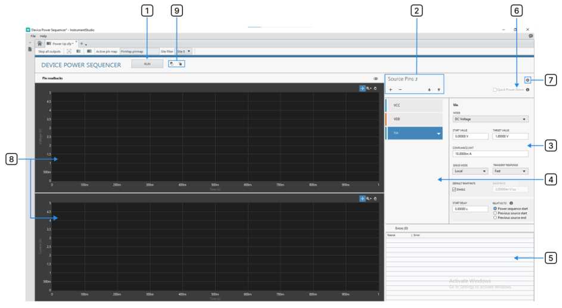
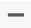
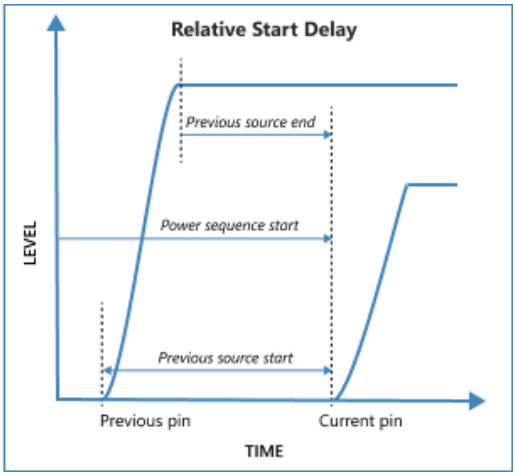
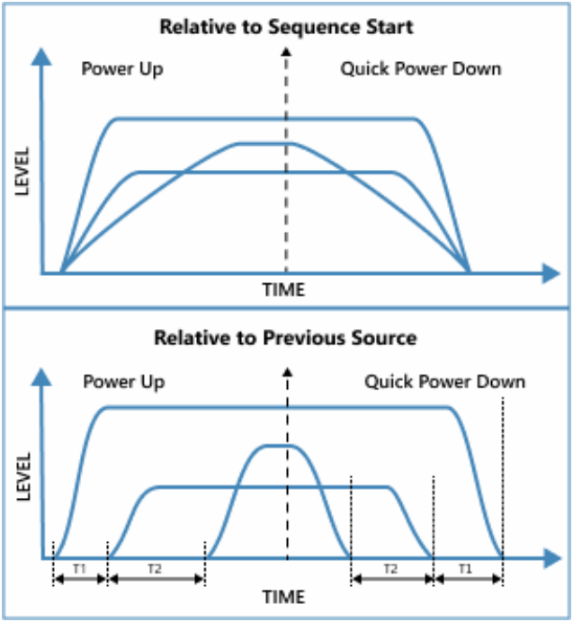

# Device Power Sequencer Manual

## User Interface

The Device Power Sequencer large panel has the “Source Pins” section to add the power pins and define its configurations, and “Pin readbacks” to monitor,
and display the actual sequence generated by the instrument on run.

1. Run/Stop Button  
The Run/Stop Button is used to apply/abort the configured source sequence.
On clicking the Stop button, source pins will be powered down with default 
ramp rate in the reverse or defined order during Power Up or Power Down
respectively.

2. Sequence Configuration  
Add pins and define the required sequence for a Power Up or Power Down 
device.  
**Add/Remove Pin**
- Add Pin  : Add new pin to the sequence. Each addition will display a drop-down listing the pins connected to DCPower from Pin Map for quick selection.  
*Note: The same pin cannot be configured twice in the pin configurations.*  
- Remove Pin : Click a pin to select it (highlighted in blue) and click “Remove” button to delete the pin from the sequence.  
**Source Pin Reorder**
Reorder the pins in teh sequence using teh reorder buttons. Select the required pin to reorder, use the Up/Down Arrow reorder buttons to move the pin along the list one level at a time.  
Drag and Drop: Pins can also be reordered by selecting and dragging the pin to the required level.  
**Sequence Mode Indicator**
The sequence mode indicator shows if the sequence is configured for Power 
Up or Power Down mode. The mode is determined by the “Start Value” and 
“Target Value” of the first power pin in the sequence.
*Note: To avoid errors, all pins following the first pin must have configurations to match the Power Up/Power Down mode set in the first pin.*  
Example:  
- For Power Up Mode: Set the Start Value as 0V and Target Value as 3V.  
- For Power Down Mode: Set the Start Value as 3V and Target Value as 0V.  

3. Source Pin Configuration  
The Source Configuration Tab is used to change the source configurations of the selected pin.  
- **Source Mode** - Only DC Voltage and DC Current modes are supported.  
- **Start Value** - Specifies the source start value of the ramp from which the pin ramps up or down to reach the Target Value. If the pin is only to be monitored configure the same values for start and target values.
- **Target Value** - Specifies the Target level of the ramp to which the pin ramps up or down from the Start Value. If the pin is only to be monitored configure the same values for start and target values. During the measurement, Target Value validation will be done with a tolerance of 10%. If the target values are not reached due to some setup errors, all the pins will be powered down and error is thrown.
- **Compliance Limit** - It is the range of voltage/current that the SMU can source or sink while maintaining proper operation and control over the Device Under 
Test (DUT). It defines the maximum or minimum voltage and current limits within which the SMU can generate without reaching its hardware limits or damaging the DUT. For Voltage Source, the compliance is checked in current and vice-versa.  
If there is compliance hit during the Power Up/Power Down after the given start delay for 100 us, all the pins will be powered down and error is thrown to user.  
- **Sense Mode** - 
  - Local Sense - Measurements taken with local sense use a single set of leads for output and voltage measurement.  
  - Remote Sense - Remote sense, or 4-wire sense, uses 4-wire connections to the DUT for accurate voltage measurements by compensating for output lead voltage drop.
- **Transient Response** - Determines how a supply responds to a sudden change in load. Please refer to SourceAdapt for more information. Supported options are:
  - Slow
  - Normal
  - Fast
- **Default Ramp Rate** - Enable the checkbox to use the default ramp rate (fastest possible) of the SMU which depends on SMU capabilities, SourceAdapt settings and load.
*Note: "Default Ramp Rate” option sets the maximum ramp rate possible, and it depends on the source update rate of SMU. So actual ramp rate might vary depending on the SMU slew rate.*  
- **Ramp Rate** - The rate at which the pins should be powered up/down to reach the target level. Disable the “Default Ramp Rate” to configure a custom rate 
within the limit of the SMU. Maximum Ramp Rate depends on maximum source update rate and slew rate of the corresponding SMU. It will switch to “Default Ramp Rate” when the configurations go beyond the supported rate. Refer to [FAQ](faq.md) for more information on the ramp rate calculation.    
*Note: Supported ramp rate by a pin depends on SMU capabilities. Refer to [FAQ](faq.md) for more details. When “Default Ramp Rate” is enabled, the value in the “Ramp Rate” control is ignored and disabled. The ramp rate displayed might not be accurate.*  
- **Start Delay** - Delay, in secs, for the pin to start powering up or down relative to previous pin in the sequence. To allow settling of previous pin, add the 
settling time as delay to this pin before it starts.  
For a pin, Start Delay can be configured up to 20 seconds.  
There might be additional synchronization delay between first pin and rest of the pins of ~10 to 15 us (Depends on trigger propagation delays and different 
Power Up delays among different NI SMUs).  
*Note: The start delay to be provided depends on the settling time of the previous pin. Refer Settling Time for more details.*  
- **Relative To** - Specifies when to introduce the delay before starting the pin source.
  - Power Sequence Start: Pin will wait for the given delay from the start of power sequence and start the sourcing.  
  - Previous Source Start: Pin will wait for the given delay after the start of previous pin in the sequence and start the sourcing (this does not apply for the first pin in the sequence).  
  - Previous Source End: Pin will wait for the given delay after the end of previous pin (source complete of previous pin) in the sequence and start the sourcing.  
  
*Note: Setting Relative to option to “End of Prev Pin” when the previous pin is configured to use default ramp rate is not recommended since the Add-On does not know the actual ramp rate of each SMUs.*  
  
4. Pin Sequence List  
Display the sequence of the pins which is configured for Powering Up or Down the device.  

5. Error Table
  - Displays all the errors and warnings for the pins in sequence.  
  - Double click an error to view its corresponding pin configuration.  
  - After execution, it cannot capture errors (shown in the banner) but displays the warnings.  

6. Quick Power Down Button  
Quick Power Down to bring all sourced pins back to “Start Value” in reverse 
order. It is enabled only after a successful Power Up.  
*Note: If Default Ramp Rate is used, rise time would be calculated based on maximum source update rate of the SMUs.*  
  

7. Advanced Setting Menu
  - **Capture data**: Log all measurements. By default, data capture is turned off.  
    - Enable the Capture data in the advanced settings to log data.  
    - The measurements will be logged in the folder “C:\Users\Public\Documents\National Instruments\DPS\Logs”.  
    - The log file will contain details of pin configurations, measured voltage and current values measured during source.  
*Note: To log the data, ‘Capture data’ should be enabled before running the measurement.  
  - **Power Line Frequency**: Specifies the Power Line Frequency for specified channel(s). NI-DCPower uses this value to select a time base for setting the aperture Time property in power line cycles (PLCs). 2 Modes: 50 Hz & 60 Hz. Default being 60 Hz.  

8. Measurement Results Graph
Displays the measured Voltage and Current values on a successful sequence run.  
  - **Plot Legend**: Displays plot pin name and plot color. Control the plot visibility for each pin by selecting/unselecting the checkbox beside each pin name.  
  - **Graph Palette**:  
  - **Graph Data Export**: The data points of the graph can be exported to the clipboard or Excel file using the export option available. Right click on the graph and select the required option.  

## Frequently Asked Questions
[FAQ](faq.md)

